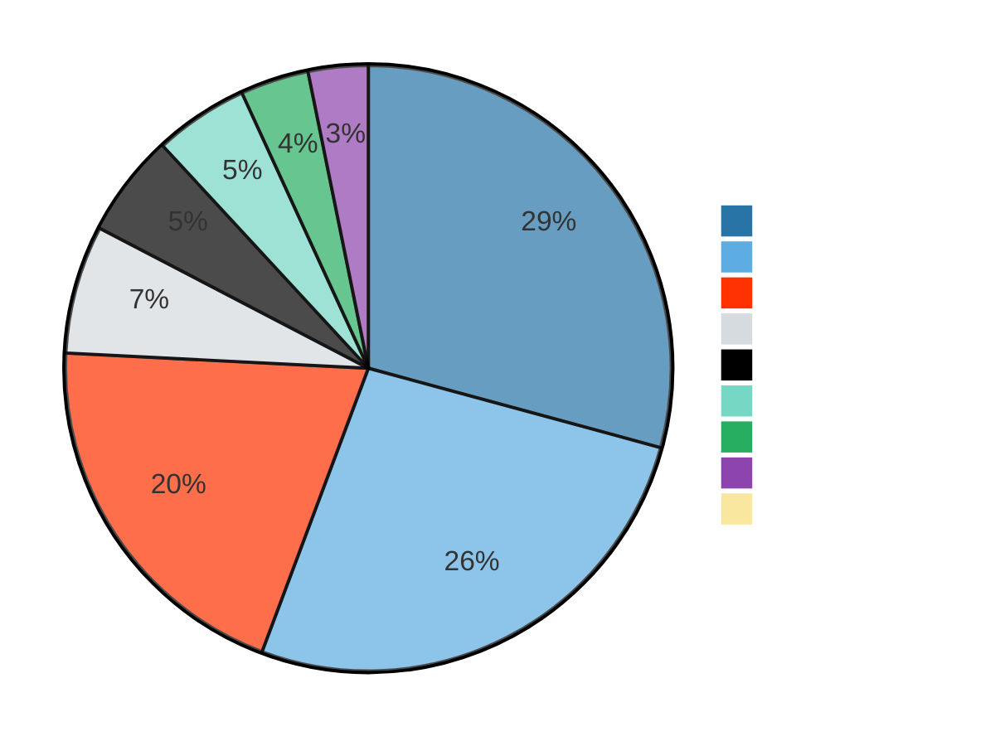
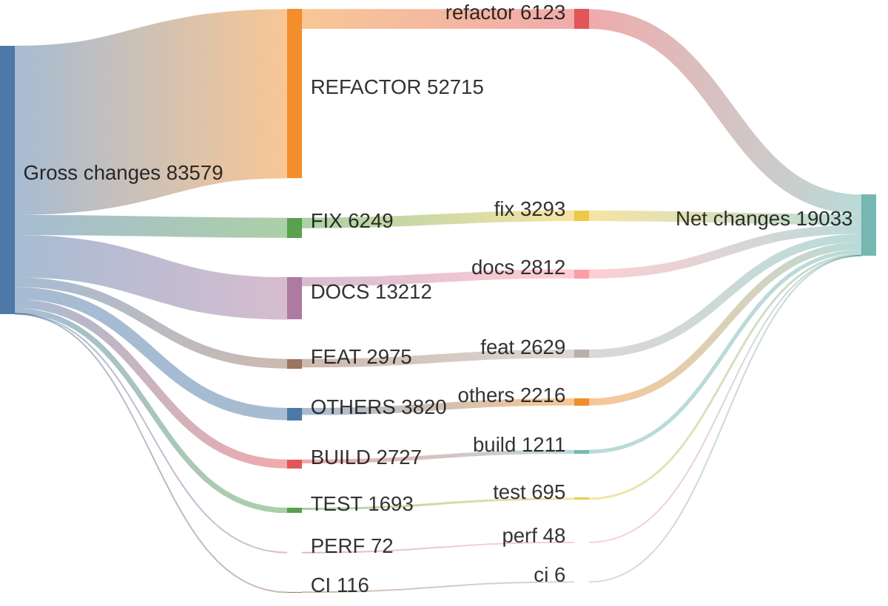
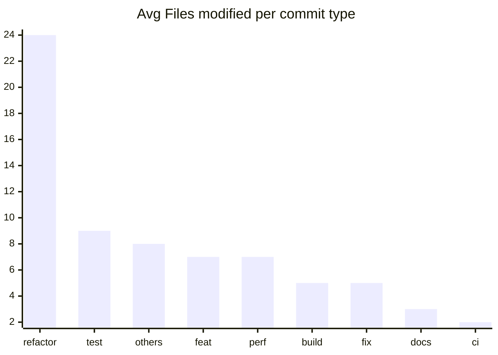

# v17.2.0 ... v17.3.0

> **WARNING**
> 

12 non conventional commits found:
<ul>
> <li>release: cut the v17.3.0 release</li>
> <li>release: cut the v17.3.0-rc.0 release</li>
> <li>release: cut the v17.3.0-next.1 release</li>
> <li>release: bump Angular DevTools version to 1.0.11 (#54631)</li>
> <li>Revert "refactor(devtools): implement iframe support for Angular DevTools' browser code (#53934)" (#54629)</li>
> <li>Revert "refactor(devtools): implement multiframe support in devtools page (#53934)" (#54629)</li>
> <li>Revert "fix(compiler-cli): identify aliased initializer functions (#54480)" (#54595)</li>
> <li>release: cut the v17.3.0-next.0 release</li>
> <li>release: bump Angular DevTools version to 1.0.10 (#54523)</li>
> <li>Revert "fix(docs-infra): process mermaid code blocks (#54434)" (#54448)</li>
> <li>release: cut the zone.js-0.14.4 release (#54409)</li>
> <li>release: bump the next branch to v17.3.0-next.0</li>
> </ul>

