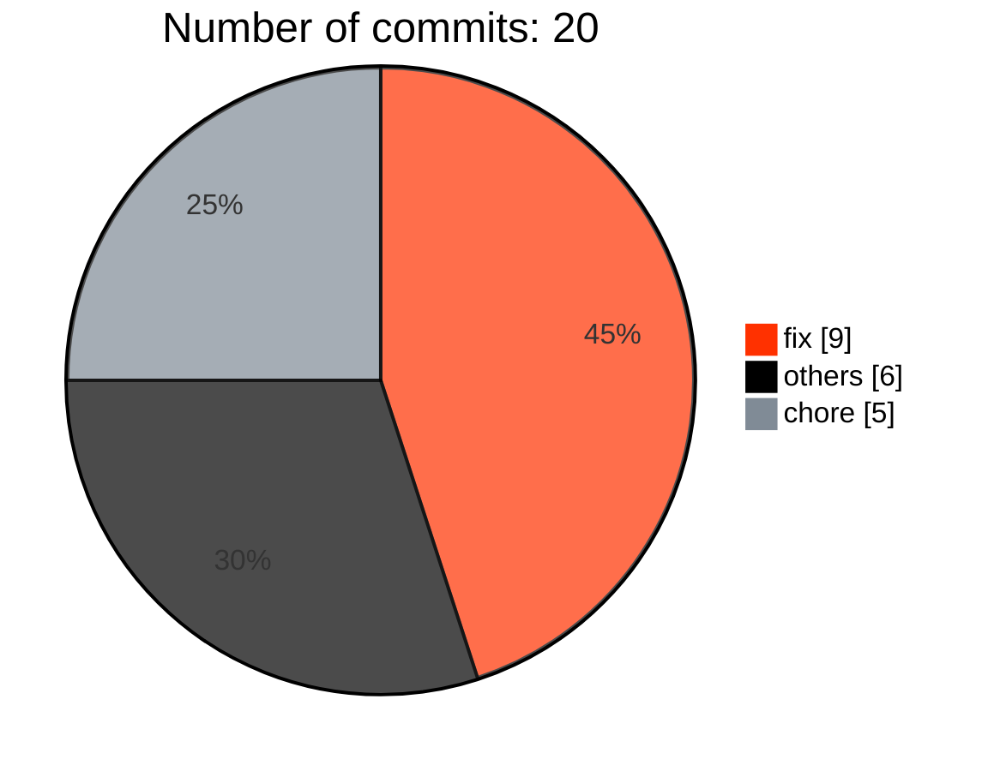
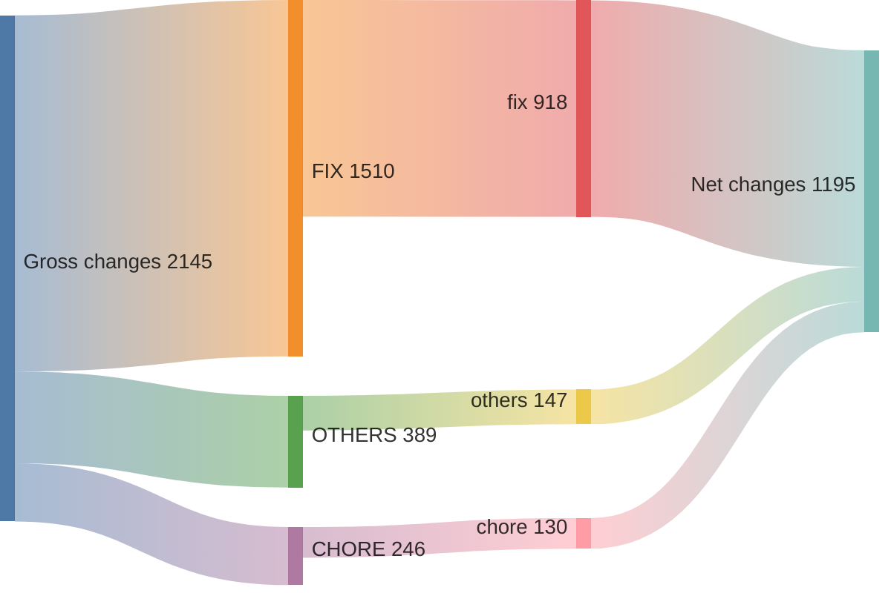
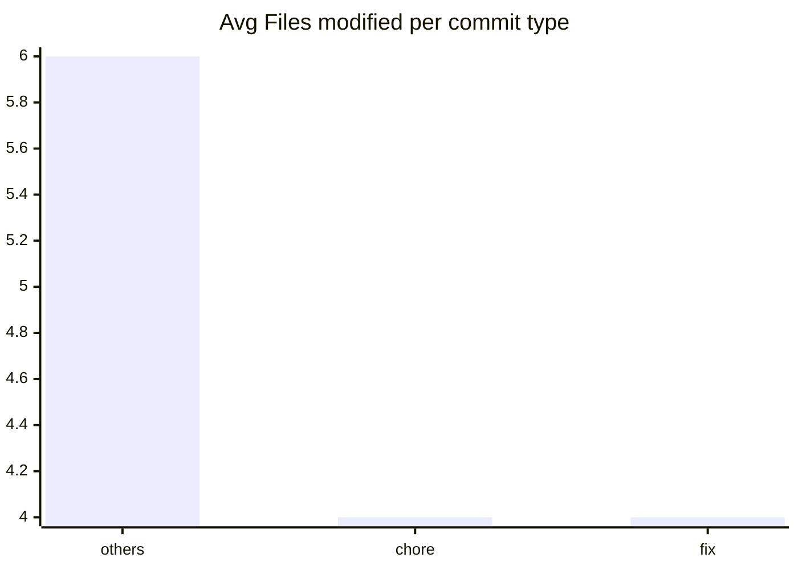

# v2.10.0 ... v2.10.3

> **WARNING**
> 

6 non conventional commits found:
<ul>
> <li>Bump version to 2.10.3 (#17513)</li>
> <li>Merge pull request from GHSA-g623-jcgg-mhmm</li>
> <li>Merge pull request from GHSA-jwv5-8mqv-g387</li>
> <li>Bump version to 2.10.2 (#17370)</li>
> <li>Corrected certificate managment for OCI helm charts (#16656) (#17320)</li>
> <li>Bump version to 2.10.1 (#17211)</li>
> </ul>

