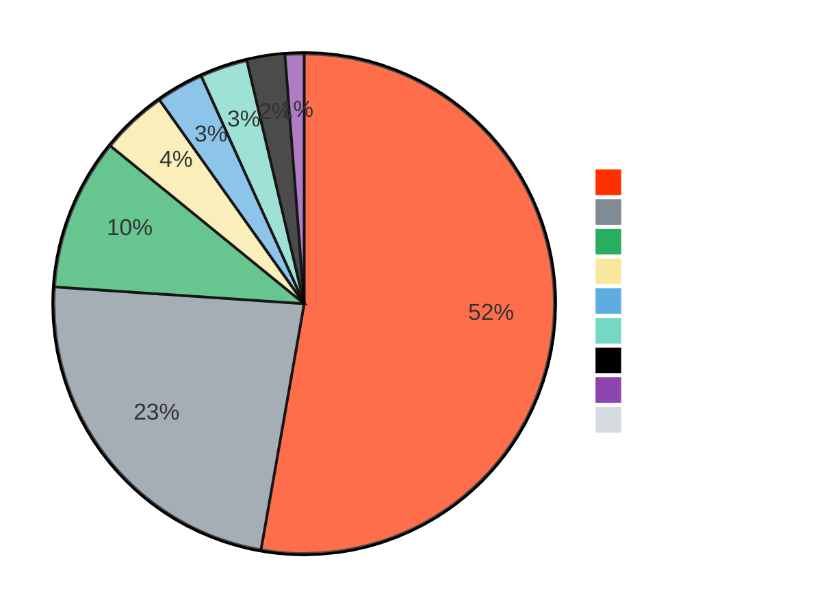
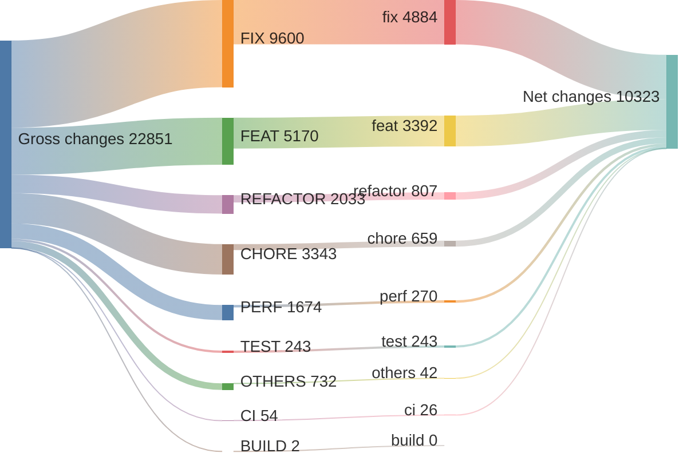
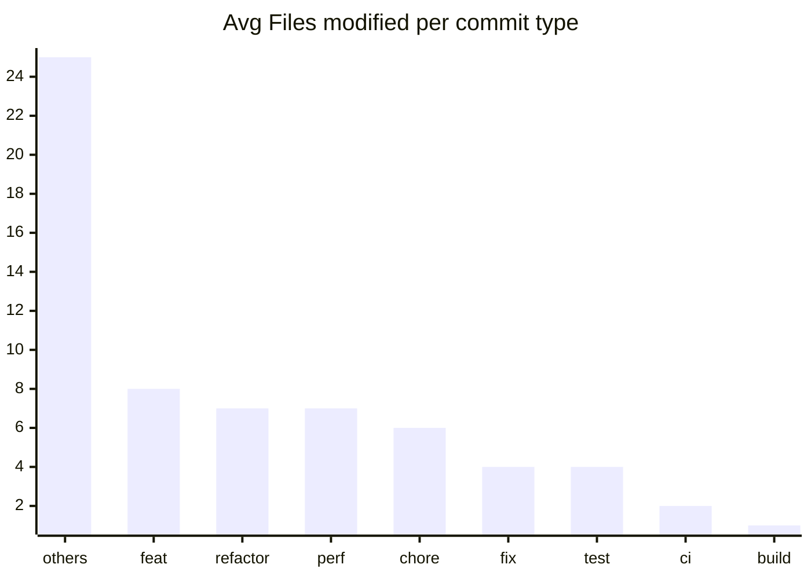

# v1.41.0 ... v1.41.3

> **WARNING**
> 

4 non conventional commits found:
<ul>
> <li>1.41.3 (#22925)</li>
> <li>1.41.2 (#22791)</li>
> <li>1.41.1 (#22642)</li>
> <li>Revert "fix(publish): error if there are uncommitted changes (#22613)" (#22625)</li>
> </ul>

