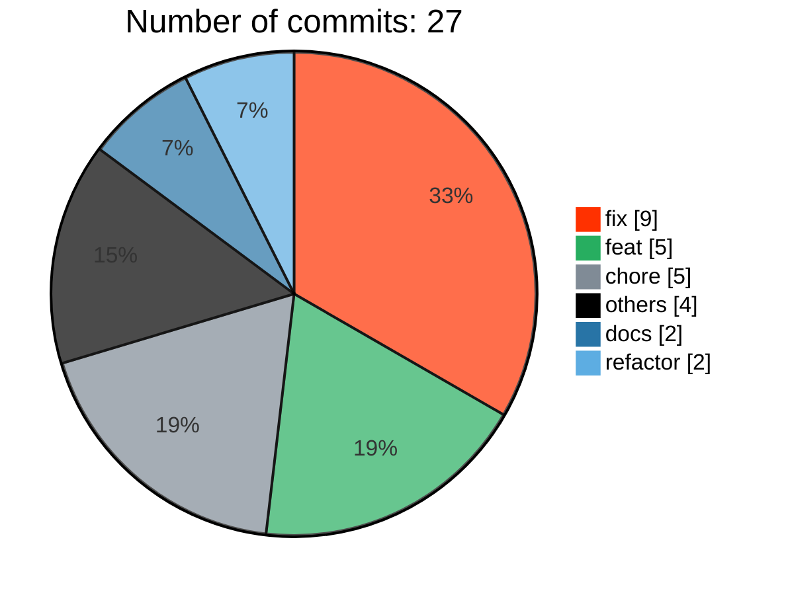
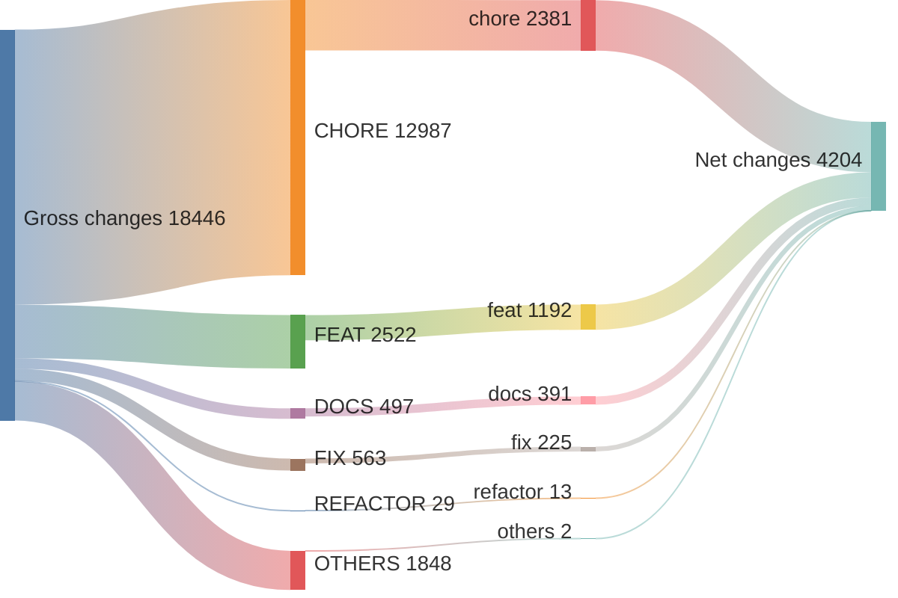
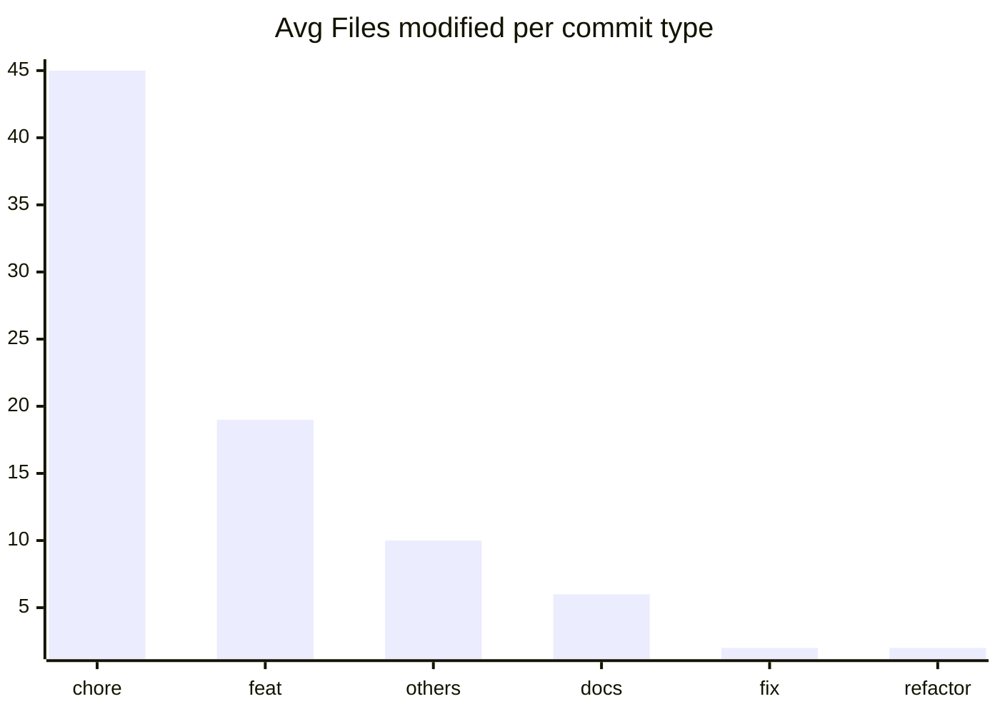

# v3.0.0 ... v3.1.0

> **WARNING**
> 

4 non conventional commits found:
<ul>
> <li>v3.1.0</li>
> <li>update lockfile</li>
> <li>remove problematic @ts-expect-error</li>
> <li>update lockfile</li>
> </ul>

