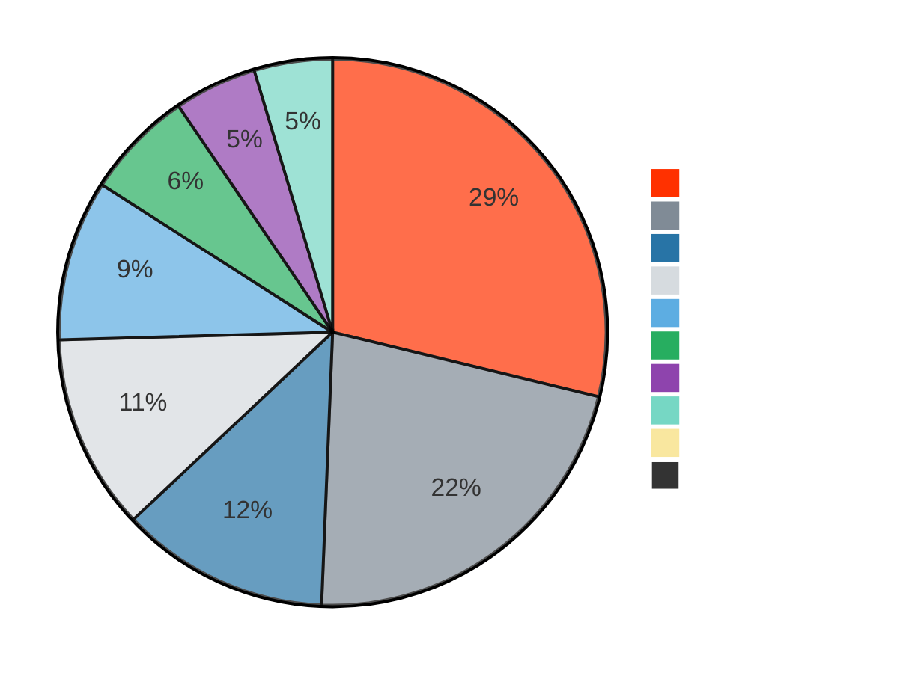
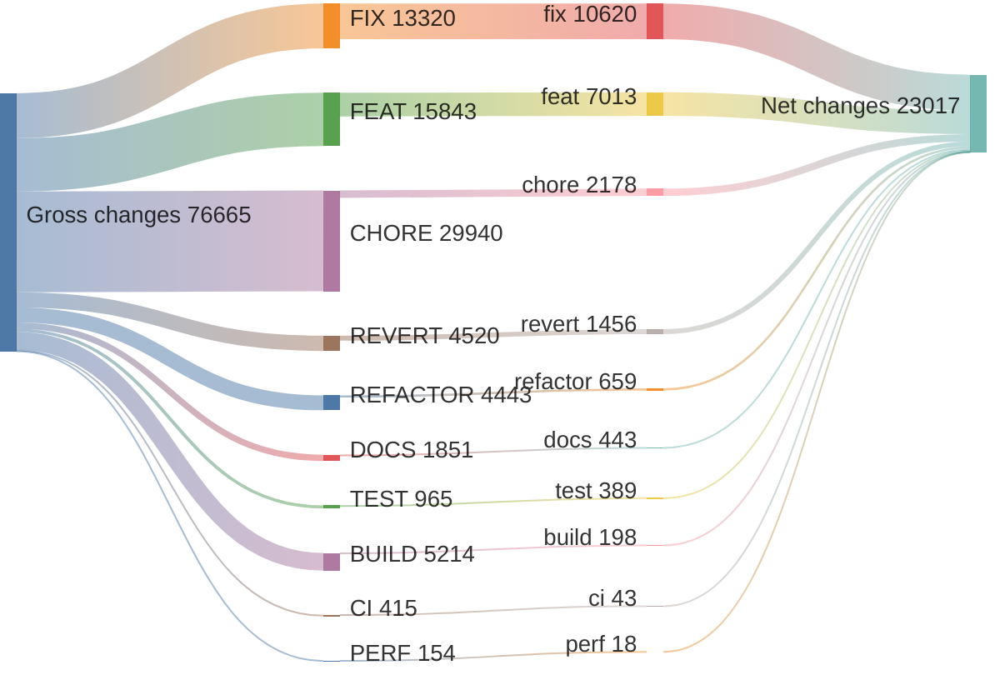
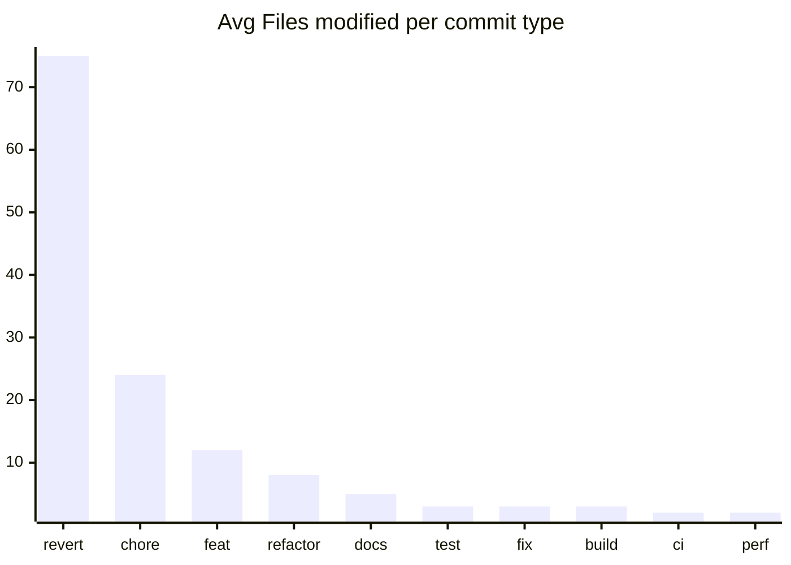

# v29.1.0 ... v29.1.4

``` mermaid
%%{init:{'theme':'base','themeVariables':{'pieTitleTextColor': '#fff','pieLegendTextColor': '#fff',
'pie1':'#ff3100','pie2':'#808b96','pie3':'#2874a6','pie4':'#d6dbdf','pie5':'#5dade2','pie6':'#27ae60','pie7':'#8e44ad','pie8':'#76d7c4','pie9':'#f9e79f','pie10':''
}}}%%
pie showData title Number of commits: 392
"fix": 112
"chore": 85
"docs": 48
"build": 45
"refactor": 37
"feat": 25
"ci": 19
"test": 18
"perf": 2
"revert": 1
```

```mermaid
%%{init:{"sankey":{"nodeAlignment":"left"}}}%%
sankey-beta
Gross changes,FIX,13320
FIX,fix,10620
fix,Net changes,10620
Gross changes,FEAT,15843
FEAT,feat,7013
feat,Net changes,7013
Gross changes,CHORE,29940
CHORE,chore,2178
chore,Net changes,2178
Gross changes,REVERT,4520
REVERT,revert,1456
revert,Net changes,1456
Gross changes,REFACTOR,4443
REFACTOR,refactor,659
refactor,Net changes,659
Gross changes,DOCS,1851
DOCS,docs,443
docs,Net changes,443
Gross changes,TEST,965
TEST,test,389
test,Net changes,389
Gross changes,BUILD,5214
BUILD,build,198
build,Net changes,198
Gross changes,CI,415
CI,ci,43
ci,Net changes,43
Gross changes,PERF,154
PERF,perf,18
perf,Net changes,18
```

```mermaid
%%{init:{"themeVariables":{"xyChart":{"backgroundColor":"transparent"}}}}%%
xychart-beta
title "Avg Files modified per commit type"
x-axis [revert,chore,feat,refactor,docs,test,fix,build,ci,perf]
bar [75,24,12,8,5,3,3,3,2,2]
```