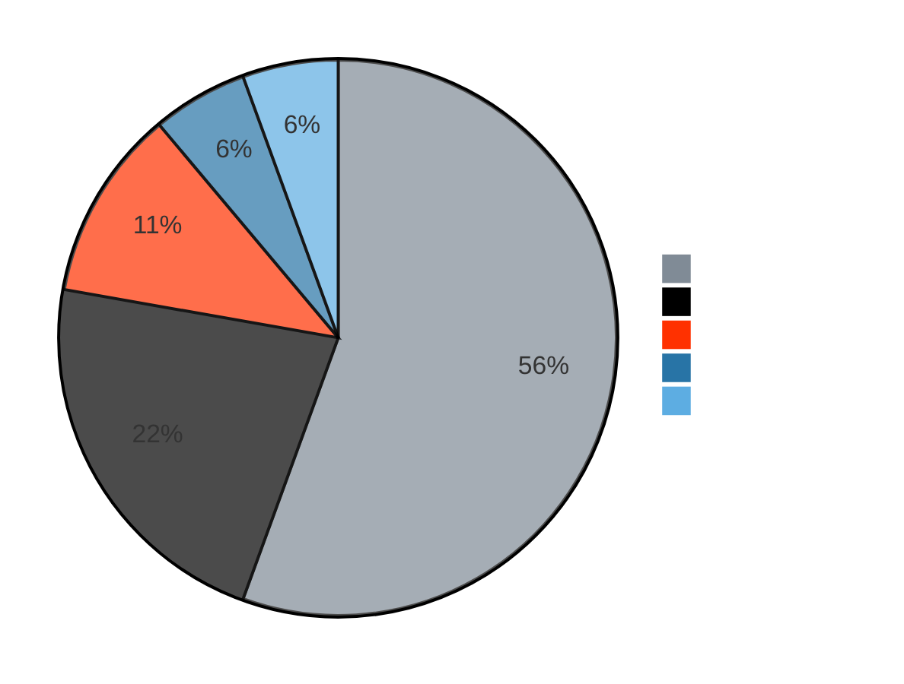
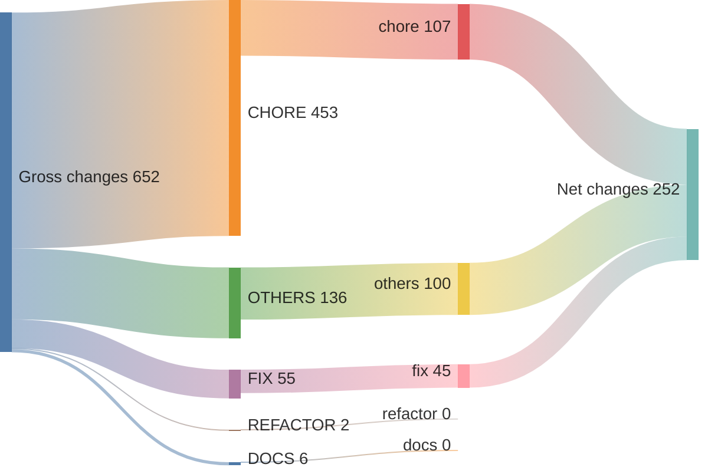
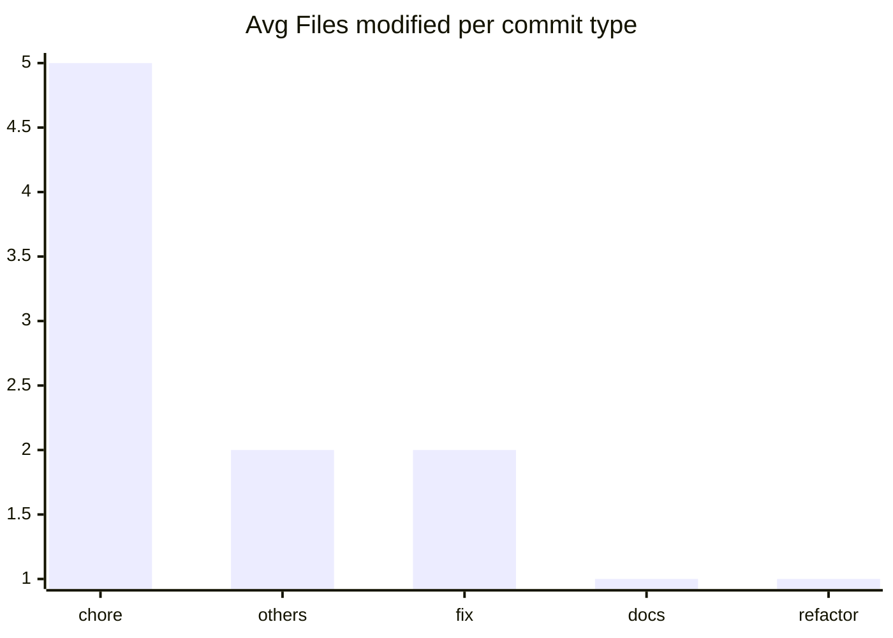

# v1.9.0 ... v1.9.1

> **WARNING**
> 

4 non conventional commits found:
<ul>
> <li>Ready release gin 1.9.1 (by: thinkerou) (#3630)</li>
> <li>Fix typos in ISSUE_TEMPLATE.md (#3616)</li>
> <li>improve render code coverage (#3525)</li>
> <li>Convert strings and slices using the officially recommended way (#3344)</li>
> </ul>

