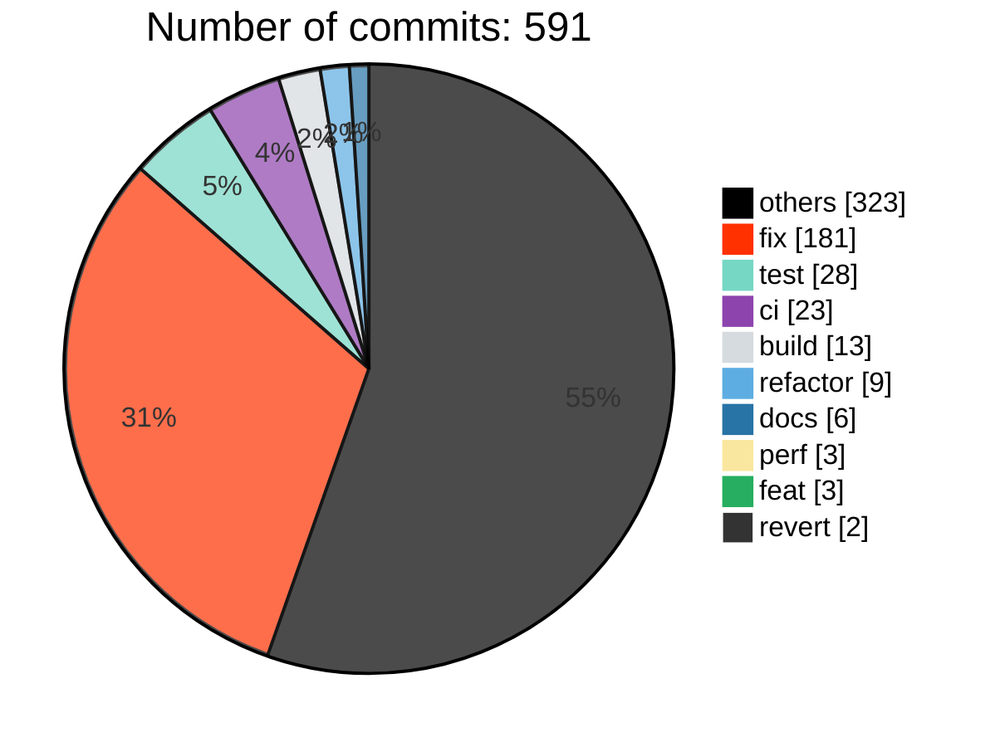
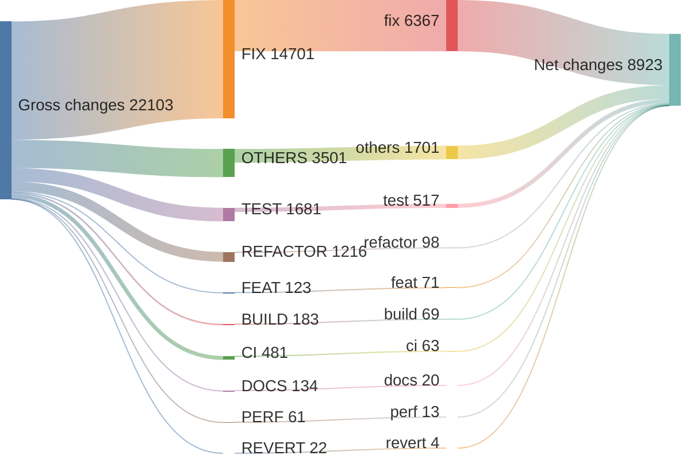
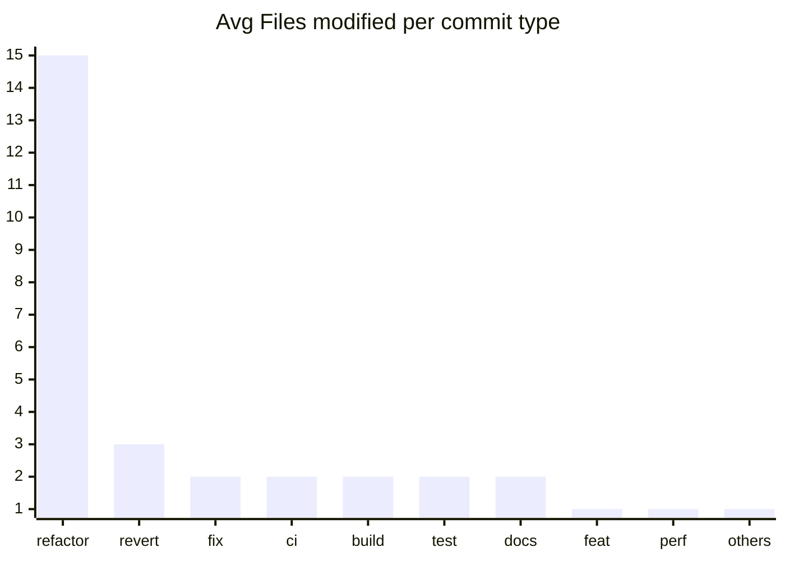

# v0.9.0 ... v0.9.5

> **WARNING**
> 

323 non conventional commits found:
<ul>
> <li>NVIM 0.9.5</li>
> <li>Merge pull request #26720 from neovim/backport-26719-to-release-0.9</li>
> <li>Merge pull request #26680 from zeertzjq/backport</li>
> <li>Merge pull request #26644 from jamessan/big-endian-fixes</li>
> <li>Merge pull request #26662 from neovim/backport-26660-to-release-0.9</li>
> <li>vim-patch:9.0.2178: reg_executing() wrong for :normal with range</li>
> <li>Merge pull request #26649 from neovim/backport-26648-to-release-0.9</li>
> <li>Merge pull request #26544 from neovim/backport-26542-to-release-0.9</li>
> <li>vim-patch:9.0.2159: screenpos() may crash with neg. column</li>
> <li>Merge pull request #26477 from neovim/backport-26476-to-release-0.9</li>
> <li>vim-patch:ff0baca86523</li>
> <li>[Backport release-0.9] fix(log): increase size of buffer for nvim instance name (#26450)</li>
> <li>Merge pull request #26447 from neovim/backport-26445-to-release-0.9</li>
> <li>Merge pull request #26444 from neovim/backport-23343-to-release-0.9</li>
> <li>Merge pull request #26443 from neovim/backport-26442-to-release-0.9</li>
> <li>Merge pull request #26413 from zeertzjq/backport</li>
> <li>vim-patch:9.0.2151: 'breakindent' is not drawn after diff filler lines</li>
> <li>[Backport release-0.9] fix: vim.treesitter.get_node() now correctly takes opts.lang (#26382)</li>
> <li>Merge pull request #26342 from neovim/backport-26341-to-release-0.9</li>
> <li>Merge pull request #26313 from zeertzjq/backport</li>
> <li>Merge pull request #26299 from neovim/backport-26085-to-release-0.9</li>
> <li>Merge pull request #26272 from neovim/backport-25726-to-release-0.9</li>
> <li>Merge pull request #26210 from neovim/backport-26203-to-release-0.9</li>
> <li>Merge pull request #26205 from jamessan/nlua_error-crash</li>
> <li>Merge pull request #26206 from neovim/backport-26201-to-release-0.9</li>
> <li>Merge pull request #26188 from neovim/backport-26187-to-release-0.9</li>
> <li>Merge pull request #26186 from neovim/backport-26185-to-release-0.9</li>
> <li>Merge pull request #26178 from neovim/backport-26177-to-release-0.9</li>
> <li>Merge pull request #26161 from zeertzjq/backport</li>
> <li>vim-patch:9.0.0598: using negative array index with negative width window</li>
> <li>vim-patch:9.0.0492: cmdwin test fails on MS-Windows</li>
> <li>vim-patch:9.0.0490: using freed memory with cmdwin and BufEnter autocmd</li>
> <li>vim-patch:9.0.0249: no test for what 9.0.0234 fixes</li>
> <li>vim-patch:9.0.0218: reading before the start of the line</li>
> <li>vim-patch:9.0.0064: confusing error when using "q:" in command line window</li>
> <li>Merge pull request #25982 from zeertzjq/backport</li>
> <li>Merge pull request #25923 from neovim/backport-25922-to-release-0.9</li>
> <li>Merge pull request #25921 from neovim/backport-25911-to-release-0.9</li>
> <li>Merge pull request #25849 from neovim/backport-25848-to-release-0.9</li>
> <li>Merge pull request #25846 from neovim/backport-25845-to-release-0.9</li>
> <li>Merge pull request #25821 from neovim/backport-25820-to-release-0.9</li>
> <li>Merge pull request #25772 from zeertzjq/backport</li>
> <li>Merge pull request #25766 from neovim/backport-25763-to-release-0.9</li>
> <li>Merge pull request #25731 from neovim/backport-25498-to-release-0.9</li>
> <li>Merge pull request #25699 from neovim/backport-25698-to-release-0.9</li>
> <li>Merge pull request #25695 from neovim/backport-25694-to-release-0.9</li>
> <li>[Backport release-0.9] feat(highlight): Allow hyphens (-) in highlight group names (#25661)</li>
> <li>Merge pull request #25650 from neovim/backport-25649-to-release-0.9</li>
> <li>Merge pull request #25632 from zeertzjq/backport</li>
> <li>Merge pull request #25613 from neovim/backport-25612-to-release-0.9</li>
> <li>version bump</li>
> <li>NVIM 0.9.4</li>
> <li>version bump</li>
> <li>NVIM 0.9.3</li>
> <li>[backport release-0.9] backport #25464 (#25560)</li>
> <li>Merge pull request #25497 from zeertzjq/backport</li>
> <li>vim-patch:9.0.1772: Cursor may be adjusted in 'splitkeep'ed windows</li>
> <li>vim-patch:9.0.1599: Cursor not adjusted when 'splitkeep' is not "cursor"</li>
> <li>Merge pull request #25496 from neovim/backport-25424-to-release-0.9</li>
> <li>Merge pull request #25482 from neovim/backport-25481-to-release-0.9</li>
> <li>Merge pull request #25431 from zeertzjq/backport</li>
> <li>vim-patch:9.0.1956: Custom completion skips orig cmdline if it invokes glob()</li>
> <li>Merge pull request #25408 from neovim/backport-25399-to-release-0.9</li>
> <li>Merge pull request #25407 from neovim/backport-24769-to-release-0.9</li>
> <li>vim-patch:9.0.1735: Rename completion specific findex var</li>
> <li>Merge pull request #25388 from neovim/backport-25383-to-release-0.9</li>
> <li>vim-patch:8.2.3467: CursorHoldI event interferes with "CTRL-G U"</li>
> <li>Merge pull request #25368 from neovim/backport-25362-to-release-0.9</li>
> <li>Merge pull request #25355 from neovim/backport-25354-to-release-0.9</li>
> <li>Merge pull request #25353 from neovim/backport-25351-to-release-0.9</li>
> <li>Merge pull request #25343 from neovim/backport-25342-to-release-0.9</li>
> <li>Merge pull request #25329 from neovim/backport-25328-to-release-0.9</li>
> <li>Merge pull request #25322 from neovim/backport-25321-to-release-0.9</li>
> <li>Merge pull request #25320 from neovim/backport-25318-to-release-0.9</li>
> <li>Merge pull request #25319 from neovim/backport-25317-to-release-0.9</li>
> <li>vim-patch:8.2.4609: :unhide does not check for failing to close a window</li>
> <li>Merge pull request #25279 from neovim/backport-25277-to-release-0.9</li>
> <li>Merge pull request #25250 from neovim/backport-25228-to-release-0.9</li>
> <li>Merge pull request #25249 from neovim/backport-25248-to-release-0.9</li>
> <li>vim-patch:9.0.1915: r_CTRL-C works differently in visual mode</li>
> <li>Merge pull request #25226 from neovim/backport-25223-to-release-0.9</li>
> <li>Merge pull request #25206 from neovim/backport-25204-to-release-0.9</li>
> <li>Merge pull request #25202 from zeertzjq/backport</li>
> <li>Merge pull request #25200 from neovim/backport-25199-to-release-0.9</li>
> <li>[Backport release-0.9] fix: invoke changed_bytes when rewriting tabs (#25174)</li>
> <li>[Backport release-0.9] fix(treesitter): language.add - only register parser if it exists</li>
> <li>Merge pull request #25144 from neovim/backport-24983-to-release-0.9</li>
> <li>Merge pull request #25142 from neovim/backport-25133-to-release-0.9</li>
> <li>Merge pull request #25122 from neovim/backport-25121-to-release-0.9</li>
> <li>Merge pull request #25117 from neovim/backport-25115-to-release-0.9</li>
> <li>Merge pull request #25111 from llllvvuu/backport/25109</li>
> <li>[Backport release-0.9] fix(languagetree): remove double recursion in LanguageTree:parse</li>
> <li>Merge pull request #25091 from neovim/backport-25090-to-release-0.9</li>
> <li>version bump</li>
> <li>NVIM 0.9.2</li>
> <li>Merge pull request #25022 from neovim/backport-25021-to-release-0.9</li>
> <li>vim-patch:9.0.1866: undo is synced after character find</li>
> <li>Merge pull request #24999 from neovim/backport-24997-to-release-0.9</li>
> <li>Merge pull request #24995 from neovim/backport-24993-to-release-0.9</li>
> <li>vim-patch:9.0.1840: [security] use-after-free in do_ecmd</li>
> <li>Merge pull request #24984 from zeertzjq/backport</li>
> <li>Revert "Revert "[Backport release-0.9] fix(ui): propagate line flags on grid_line events""</li>
> <li>Revert "[Backport release-0.9] fix(ui): propagate line flags on grid_line events"</li>
> <li>[Backport release-0.9] fix(filetype): make sure buffer is valid before call nvim_buf_call (#24950)</li>
> <li>Merge pull request #24923 from neovim/fix/ts-double-free</li>
> <li>Merge pull request #24907 from neovim/backport-24848-to-release-0.9</li>
> <li>Merge pull request #24906 from neovim/backport-24407-to-release-0.9</li>
> <li>Merge pull request #24905 from neovim/backport-23462-to-release-0.9</li>
> <li>Merge pull request #24904 from neovim/backport-24871-to-release-0.9</li>
> <li>Merge pull request #24885 from neovim/backport-24859-to-release-0.9</li>
> <li>Merge pull request #24883 from neovim/backport-24879-to-release-0.9</li>
> <li>Merge pull request #24809 from neovim/backport-24806-to-release-0.9</li>
> <li>vim-patch:9.0.1759: Visual highlight not working with cursor at end of screen line</li>
> <li>Merge pull request #24777 from neovim/backport-24776-to-release-0.9</li>
> <li>Merge pull request #24768 from neovim/backport-24767-to-release-0.9</li>
> <li>vim-patch:9.0.1734: :runtime completion fails for multiple args</li>
> <li>vim-patch:9.0.1714: getcompletion() "cmdline" fails after :autocmd</li>
> <li>vim-patch:9.0.1708: getcompletion() failes for user-defined commands</li>
> <li>Merge pull request #24701 from neovim/backport-24700-to-release-0.9</li>
> <li>vim-patch:cd4e4e169ab3</li>
> <li>Merge pull request #24677 from neovim/backport-24676-to-release-0.9</li>
> <li>vim-patch:9.0.1694: wrong mapping applied when replaying a char search</li>
> <li>vim-patch:9.0.1687: mapset() not properly handling script ID</li>
> <li>Merge pull request #24649 from neovim/backport-24595</li>
> <li>Merge pull request #24576 from neovim/backport-24575-to-release-0.9</li>
> <li>Merge pull request #24554 from zeertzjq/backport</li>
> <li>Merge pull request #24555 from neovim/backport-23224-to-release-0.9</li>
> <li>Merge pull request #24551 from neovim/backport-24549-to-release-0.9</li>
> <li>Merge pull request #24505 from zeertzjq/backport</li>
> <li>Merge pull request #24503 from zeertzjq/backport</li>
> <li>Merge pull request #24486 from zeertzjq/backport</li>
> <li>vim-patch:9.0.1607: screenpos() returns wrong row with diff filler lines</li>
> <li>vim-patch:9.0.1600: screenpos() does not take w_skipcol into account</li>
> <li>Merge pull request #24484 from neovim/backport-24481-to-release-0.9</li>
> <li>[Backport release-0.9] fix(ui): delay win_viewport until screen update #24182 (#24480)</li>
> <li>Merge pull request #24479 from neovim/backport-24477-to-release-0.9</li>
> <li>Merge pull request #24478 from neovim/backport-23910-to-release-0.9</li>
> <li>Merge pull request #24476 from neovim/backport-24425-to-release-0.9</li>
> <li>Merge pull request #24463 from neovim/backport-24462-to-release-0.9</li>
> <li>Merge pull request #24460 from neovim/backport-24459-to-release-0.9</li>
> <li>Merge pull request #24449 from neovim/backport-24448-to-release-0.9</li>
> <li>Merge pull request #24439 from neovim/backport-24438-to-release-0.9</li>
> <li>Merge pull request #24434 from neovim/backport-24426-to-release-0.9</li>
> <li>Merge pull request #24419 from neovim/backport-24418-to-release-0.9</li>
> <li>Merge pull request #24384 from neovim/backport-23753-to-release-0.9</li>
> <li>Merge pull request #24379 from neovim/backport-24378-to-release-0.9</li>
> <li>Merge pull request #24370 from neovim/backport-23378-to-release-0.9</li>
> <li>clipboard: suppression exit warning if exit code is >= 128</li>
> <li>Merge pull request #24358 from neovim/backport-24357-to-release-0.9</li>
> <li>Merge pull request #24321 from neovim/backport-24320-to-release-0.9</li>
> <li>Merge pull request #24318 from neovim/backport-24316-to-release-0.9</li>
> <li>Merge pull request #24307 from neovim/backport-24306-to-release-0.9</li>
> <li>Merge pull request #24298 from neovim/backport-24296-to-release-0.9</li>
> <li>Merge pull request #24269 from neovim/backport-24268-to-release-0.9</li>
> <li>Merge pull request #24259 from neovim/backport-24258-to-release-0.9</li>
> <li>Merge pull request #24245 from neovim/backport-24244-to-release-0.9</li>
> <li>Merge pull request #24243 from neovim/backport-23891-to-release-0.9</li>
> <li>Merge pull request #24217 from neovim/backport-24161-to-release-0.9</li>
> <li>Merge pull request #24211 from neovim/backport-24147-to-release-0.9</li>
> <li>Merge pull request #24208 from neovim/backport-24207-to-release-0.9</li>
> <li>Merge pull request #24201 from neovim/backport-24200-to-release-0.9</li>
> <li>Merge pull request #24199 from neovim/backport-24198-to-release-0.9</li>
> <li>Merge pull request #24193 from neovim/backport-24190-to-release-0.9</li>
> <li>[Backport release-0.9] fix(api): nvim_cmd{cmd="win_getid"} parsed as :winsize (#24189)</li>
> <li>Merge pull request #24160 from neovim/backport-24158-to-release-0.9</li>
> <li>Merge pull request #24125 from neovim/backport-24123-to-release-0.9</li>
> <li>[Backport release-0.9] fix(fs): make `normalize()` work with '/' path (#24060)</li>
> <li>Merge pull request #24036 from neovim/backport-24034-to-release-0.9</li>
> <li>vim-patch:9.0.1636: expanding a pattern interferes with cmdline completion</li>
> <li>[Backport release-0.9] fix(codelens): add buffer and line checks before displaying codelens (#24014)</li>
> <li>Merge pull request #24012 from neovim/backport-24010-to-release-0.9</li>
> <li>Merge pull request #23990 from neovim/backport-23988-to-release-0.9</li>
> <li>Merge pull request #23982 from neovim/backport-23980-to-release-0.9</li>
> <li>Merge pull request #23979 from neovim/backport-23975-to-release-0.9</li>
> <li>Merge pull request #23974 from neovim/backport-23973-to-release-0.9</li>
> <li>Merge pull request #23952 from neovim/backport-23951-to-release-0.9</li>
> <li>vim-patch:9.0.1616: quickfix text field is truncated</li>
> <li>Merge pull request #23944 from neovim/backport-23943-to-release-0.9</li>
> <li>Merge pull request #23935 from neovim/backport-23933-to-release-0.9</li>
> <li>Merge pull request #23931 from neovim/backport-23929-to-release-0.9</li>
> <li>Merge pull request #23923 from neovim/backport-23922-to-release-0.9</li>
> <li>Merge pull request #23900 from neovim/backport-23899-to-release-0.9</li>
> <li>Merge pull request #23883 from neovim/backport-23073-to-release-0.9</li>
> <li>Merge pull request #23881 from neovim/backport-23878-to-release-0.9</li>
> <li>Merge pull request #23874 from neovim/backport-23873-to-release-0.9</li>
> <li>vim-patch:9.0.1597: cursor ends up below the window after a put</li>
> <li>Merge pull request #23862 from neovim/backport-23854-to-release-0.9</li>
> <li>[Backport release-0.9] ci(response): use pagination for timeline events (#23844)</li>
> <li>[Backport release-0.9] ci: replace stale bot with custom implementation (#23843)</li>
> <li>[Backport release-0.9] ci: auto add label according title (#23842)</li>
> <li>Merge pull request #23841 from dundargoc/backport/token</li>
> <li>[Backport release-0.9] ci: update reviewers (#23837)</li>
> <li>[Backport release-0.9] ci: use a set instead of array for team reviewers (#23835)</li>
> <li>Merge pull request #23833 from neovim/backport-23626-to-release-0.9</li>
> <li>[Backport release-0.9] ci: simplify backport workflow (#23832)</li>
> <li>Merge pull request #23828 from neovim/backport-23823-to-release-0.9</li>
> <li>Merge pull request #23815 from neovim/backport-23283-to-release-0.9</li>
> <li>version bump</li>
> <li>NVIM 0.9.1</li>
> <li>Merge pull request #23810 from neovim/backport-23809-to-release-0.9</li>
> <li>[Backport release-0.9] fix(ftplugin): source Lua files after Vimscript files per directory (#23805)</li>
> <li>Merge pull request #23798 from neovim/backport-23792-to-release-0.9</li>
> <li>Merge pull request #23787 from neovim/backport-23785-to-release-0.9</li>
> <li>vim-patch:9.0.1582: :stopinsert may not work in a popup close handler</li>
> <li>Merge pull request #23779 from neovim/backport-23727-to-release-0.9</li>
> <li>Merge pull request #23778 from neovim/backport-23776-to-release-0.9</li>
> <li>backport treesitter parser and queries (#23767)</li>
> <li>[Backport release-0.9] fix(tui): don't set tty background if &bg was set before VimEnter (#23766)</li>
> <li>Merge pull request #23765 from neovim/backport-23583-to-release-0.9</li>
> <li>Merge pull request #23764 from neovim/backport-23523-to-release-0.9</li>
> <li>Merge pull request #23763 from neovim/backport-23760-to-release-0.9</li>
> <li>Merge pull request #23761 from neovim/backport-23466-to-release-0.9</li>
> <li>vim-patch:9.0.0240: crash when using ":mkspell" with an empty .dic file</li>
> <li>vim-patch:9.0.0138: not enough characters accepted for 'spellfile'</li>
> <li>Merge pull request #23718 from neovim/backport-23708-to-release-0.9</li>
> <li>Merge pull request #23716 from neovim/backport-23713-to-release-0.9</li>
> <li>Merge pull request #23715 from neovim/backport-23702-to-release-0.9</li>
> <li>Merge pull request #23700 from neovim/backport-23696-to-release-0.9</li>
> <li>[Backport release-0.9] fix(treesitter): allow foldexpr without highlights (#23673)</li>
> <li>[Backport release-0.9] fix(lsp): don't register didChangeWatchedFiles when capability not set (#23690)</li>
> <li>Merge pull request #23679 from neovim/backport-23585-to-release-0.9</li>
> <li>Merge pull request #23663 from neovim/backport-23584-to-release-0.9</li>
> <li>Merge pull request #23633 from neovim/backport-23631-to-release-0.9</li>
> <li>vim-patch:9.0.1555: setcharsearch() does not clear last searched char properly</li>
> <li>Merge pull request #23582 from neovim/backport-23557-to-release-0.9</li>
> <li>Merge pull request #23580 from neovim/backport-23492-to-release-0.9</li>
> <li>Merge pull request #23573 from neovim/backport-23555-to-release-0.9</li>
> <li>Merge pull request #23568 from neovim/backport-23566-to-release-0.9</li>
> <li>Merge pull request #23564 from neovim/backport-23175-to-release-0.9</li>
> <li>vim-patch:9.0.1464: strace filetype detection is expensive</li>
> <li>Merge pull request #23562 from neovim/backport-23428-to-release-0.9</li>
> <li>[Backport release-0.9] fix(lsp): fix relative patterns for `workspace/didChangeWatchedFiles` (#23559)</li>
> <li>[Backport release-0.9] build: add luajit runtime files when installing (#23556)</li>
> <li>Merge pull request #23537 from neovim/backport-23535-to-release-0.9</li>
> <li>Merge pull request #23536 from neovim/backport-23486-to-release-0.9</li>
> <li>[Backport release-0.9] perf(lsp): load buffer contents once when processing semantic tokens responses (#23505)</li>
> <li>[Backport release-0.9] perf(treesitter): insert/remove items efficiently (#23504)</li>
> <li>Merge pull request #23503 from neovim/backport-23415-to-release-0.9</li>
> <li>[Backport release-0.9] fix(treesitter): redraw added/removed injections properly (#23408)</li>
> <li>Merge pull request #23479 from dundargoc/backport</li>
> <li>Merge pull request #23457 from neovim/backport-23456-to-release-0.9</li>
> <li>Merge pull request #23458 from neovim/backport-23002-to-release-0.9</li>
> <li>Merge pull request #23452 from neovim/backport-23442-to-release-0.9</li>
> <li>Merge pull request #23449 from neovim/backport-23448-to-release-0.9</li>
> <li>Merge pull request #23447 from neovim/backport-23445-to-release-0.9</li>
> <li>[Backport release-0.9] fix(treesitter): do not calc folds on unloaded buffers (#23440)</li>
> <li>Merge pull request #23438 from neovim/backport-23436-to-release-0.9</li>
> <li>Merge pull request #23435 from neovim/backport-23430-to-release-0.9</li>
> <li>Merge pull request #23434 from neovim/backport-23352-to-release-0.9</li>
> <li>vim-patch:9.0.1493: popup menu position wrong in window with toolbar</li>
> <li>Merge pull request #23433 from neovim/backport-23336-to-release-0.9</li>
> <li>Merge pull request #23432 from neovim/backport-23298-to-release-0.9</li>
> <li>Merge pull request #23431 from neovim/backport-23265-to-release-0.9</li>
> <li>vim-patch:9.0.1476: lines put in non-current window are not displayed</li>
> <li>[Backport release-0.9] docs(lsp): remove vim.lsp.sync (#23419)</li>
> <li>[Backport release-0.9] perf(lsp): process semantic tokens response in a coroutine that yields every 5ms (#23414)</li>
> <li>Merge pull request #23413 from neovim/backport-23400-to-release-0.9</li>
> <li>Merge pull request #23372 from neovim/backport-23371-to-release-0.9</li>
> <li>vim-patch:8.2.3509: undo file is not synced</li>
> <li>[Backport release-0.9] fix(tui): position cursor at bottom-left before stopping</li>
> <li>Merge pull request #23359 from neovim/backport-23358-to-release-0.9</li>
> <li>vim-patch:9.0.1494: crash when recovering from corrupted swap file</li>
> <li>Merge pull request #23334 from neovim/backport-23333-to-release-0.9</li>
> <li>vim-patch:9.0.1491: wrong scrolling with ls=0 and :botright split</li>
> <li>Merge pull request #23332 from neovim/backport-23305-to-release-0.9</li>
> <li>Merge pull request #23328 from neovim/backport-23288-to-release-0.9</li>
> <li>vim-patch:9.0.1490: the ModeChanged event may be triggered too often</li>
> <li>Merge pull request #23304 from neovim/backport-23258-to-release-0.9</li>
> <li>Merge pull request #23300 from neovim/backport-23296-to-release-0.9</li>
> <li>Merge pull request #23299 from neovim/backport-23252-to-release-0.9</li>
> <li>Merge pull request #23277 from neovim/backport-23267-to-release-0.9</li>
> <li>Merge pull request #23276 from neovim/backport-23210-to-release-0.9</li>
> <li>Merge pull request #23274 from neovim/backport-23273-to-release-0.9</li>
> <li>vim-patch:9.0.1477: crash when recovering from corrupted swap file</li>
> <li>Merge pull request #23248 from neovim/backport-23234-to-release-0.9</li>
> <li>Merge pull request #23246 from zeertzjq/backport-23225-to-release-0.9</li>
> <li>Merge pull request #23245 from neovim/backport-23239-to-release-0.9</li>
> <li>Merge pull request #23244 from neovim/backport-23187-to-release-0.9</li>
> <li>[Backport release-0.9] fix(treesitter playground): fix the wrong range of a node displayed i… (#23220)</li>
> <li>[Backport release-0.9] fix(runtime): do not allow breakcheck inside runtime path calculation (#23201)</li>
> <li>[Backport release-0.9] fix(watchfiles): skip Created events when poll starts (#23197)</li>
> <li>Merge pull request #23193 from neovim/backport-23192-to-release-0.9</li>
> <li>[Backport release-0.9] fix(loader): reset hashes when running the loader (#23181)</li>
> <li>Merge pull request #23180 from neovim/backport-23179-to-release-0.9</li>
> <li>Merge pull request #23174 from neovim/backport-23005-to-release-0.9</li>
> <li>vim-patch:9.0.1461: ruler not drawn correctly when using 'rulerformat'</li>
> <li>Merge pull request #23169 from neovim/backport-23163-to-release-0.9</li>
> <li>Merge pull request #23160 from neovim/backport-23159-to-release-0.9</li>
> <li>vim-patch:9.0.1460: insufficient testing for getcmdcompltype()</li>
> <li>Merge pull request #23147 from neovim/backport-23146-to-release-0.9</li>
> <li>vim-patch:9.0.1400: find_file_in_path() is not reentrant</li>
> <li>Merge pull request #23130 from neovim/backport-23098-to-release-0.9</li>
> <li>Merge pull request #23089 from neovim/backport-22968-to-release-0.9</li>
> <li>Merge pull request #23077 from neovim/backport-23071-to-release-0.9</li>
> <li>vim-patch:9.0.1451: unnecessary redrawing when 'showcmdloc' is not "last"</li>
> <li>[Backport release-0.9] fix(api): make nvim_get_hl not return non-existing groups (#23065)</li>
> <li>Merge pull request #23060 from neovim/backport-23059-to-release-0.9</li>
> <li>vim-patch:partial:9.0.0364: clang static analyzer gives warnings</li>
> <li>Merge pull request #23050 from neovim/backport-23048-to-release-0.9</li>
> <li>vim-patch:9.0.1444: crash when passing NULL to setcmdline()</li>
> <li>Merge pull request #23049 from neovim/backport-22983-to-release-0.9</li>
> <li>Merge pull request #23047 from neovim/backport-23045-to-release-0.9</li>
> <li>[Backport release-0.9] fix(runtime): add commentstring for C# ftplugin (#23041)</li>
> <li>Merge pull request #23020 from neovim/backport-23017-to-release-0.9</li>
> <li>[Backport release-0.9] fix(treesitter): Use the correct replacement args for #gsub! directive (#23018)</li>
> <li>Merge pull request #23013 from neovim/backport-23009-to-release-0.9</li>
> <li>Merge pull request #22997 from neovim/backport-22996-to-release-0.9</li>
> <li>Merge pull request #22991 from neovim/backport-22990-to-release-0.9</li>
> <li>Merge pull request #22986 from neovim/backport-22967-to-release-0.9</li>
> <li>Merge pull request #22985 from neovim/backport-22984-to-release-0.9</li>
> <li>vim-patch:9.0.1443: ending Insert mode when accessing a hidden prompt buffer</li>
> <li>[Backport release-0.9] docs: add `hl-DiagnosticDeprecated` and `hl-DiagnosticUnnecessary` (#22964)</li>
> <li>Merge pull request #22959 from neovim/backport-22950-to-release-0.9</li>
> <li>Merge pull request #22955 from neovim/backport-22949-to-release-0.9</li>
> <li>Merge pull request #22954 from neovim/backport-22952-to-release-0.9</li>
> <li>Merge pull request #22948 from neovim/backport-22936-to-release-0.9</li>
> <li>Merge pull request #22947 from neovim/backport-22942-to-release-0.9</li>
> <li>vim-patch:9.0.1442: mapset() does not restore non-script context</li>
> <li>Merge pull request #22946 from neovim/backport-22937-to-release-0.9</li>
> <li>Merge pull request #22945 from neovim/backport-22935-to-release-0.9</li>
> <li>Merge pull request #22944 from neovim/backport-22930-to-release-0.9</li>
> <li>Merge pull request #22943 from neovim/backport-22925-to-release-0.9</li>
> <li>version bump</li>
> </ul>

