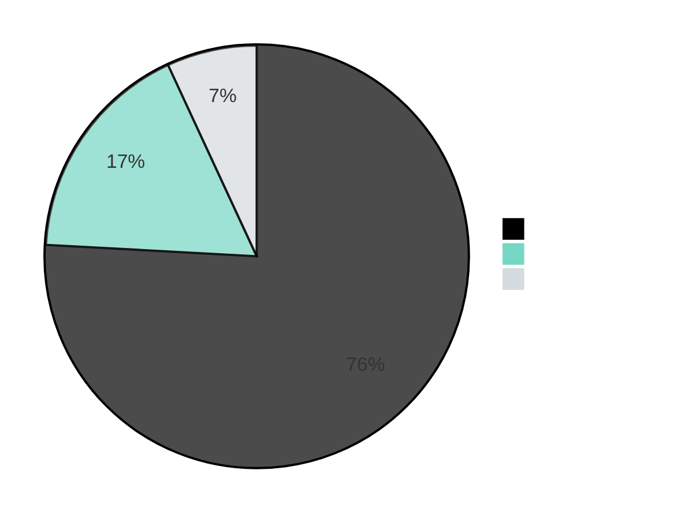
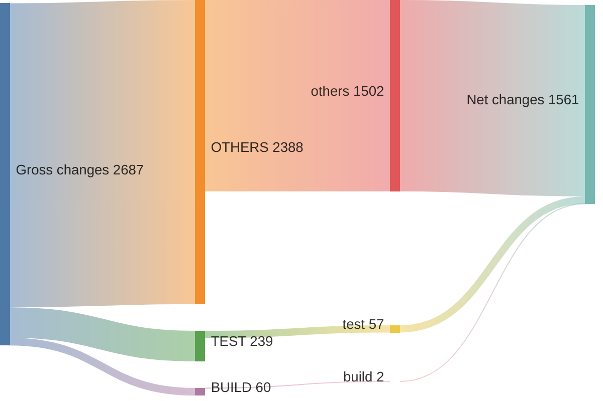
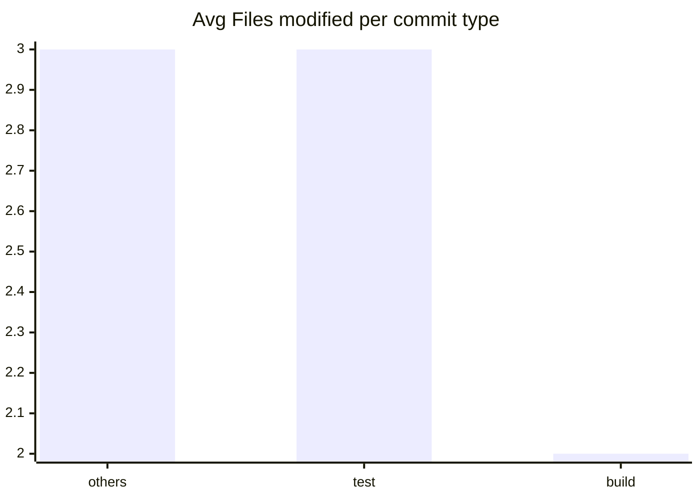

# v21.7.0 ... v21.7.1

> **WARNING**
> 

22 non conventional commits found:
<ul>
> <li>2024-03-08, Version 21.7.1 (Current)</li>
> <li>stream: do not defer construction by one microtick</li>
> <li>Revert "test_runner: do not invoke after hook when test is empty"</li>
> <li>Revert "build: workaround for node-core-utils"</li>
> <li>deps: update nghttp2 to 1.60.0</li>
> <li>benchmark: update iterations of benchmark/async_hooks/async-local-</li>
> <li>benchmark: update iterations of benchmark/domain/domain-fn-args.js</li>
> <li>meta: bump github/codeql-action from 3.23.2 to 3.24.6</li>
> <li>meta: bump actions/upload-artifact from 4.3.0 to 4.3.1</li>
> <li>meta: bump codecov/codecov-action from 4.0.1 to 4.1.0</li>
> <li>meta: bump actions/cache from 4.0.0 to 4.0.1</li>
> <li>meta: bump actions/download-artifact from 4.1.1 to 4.1.3</li>
> <li>meta: bump actions/setup-node from 4.0.1 to 4.0.2</li>
> <li>lib: make sure close net server</li>
> <li>Revert "build: fix warning in cares under GN build"</li>
> <li>doc: add policy for distribution</li>
> <li>doc: fix actual result of example is different in events</li>
> <li>doc,module: clarify hook chain execution sequence</li>
> <li>doc: clarify Corepack threat model</li>
> <li>src: fix --disable-single-executable-application</li>
> <li>lib: return directly if udp socket close before lookup</li>
> <li>Working on v21.7.1</li>
> </ul>

