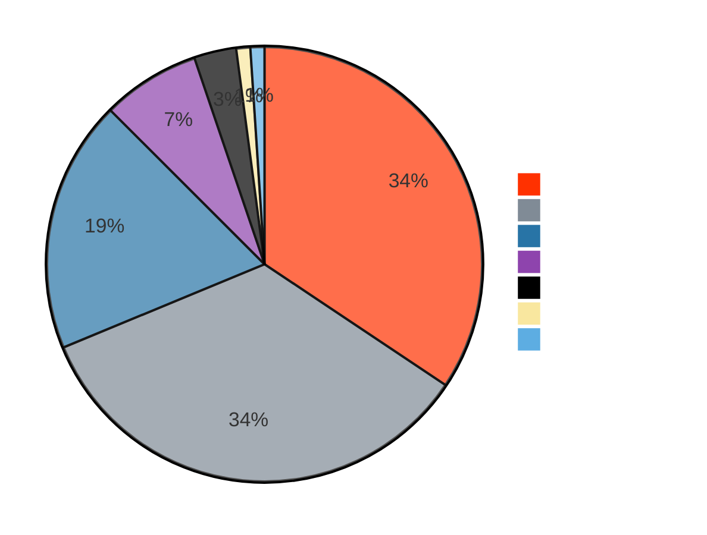
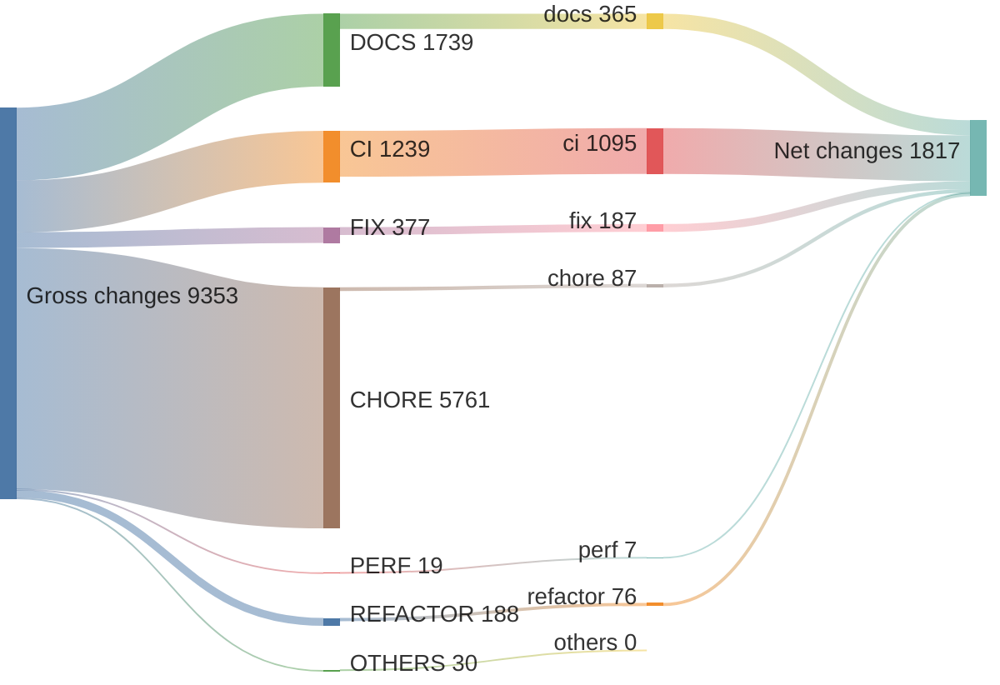
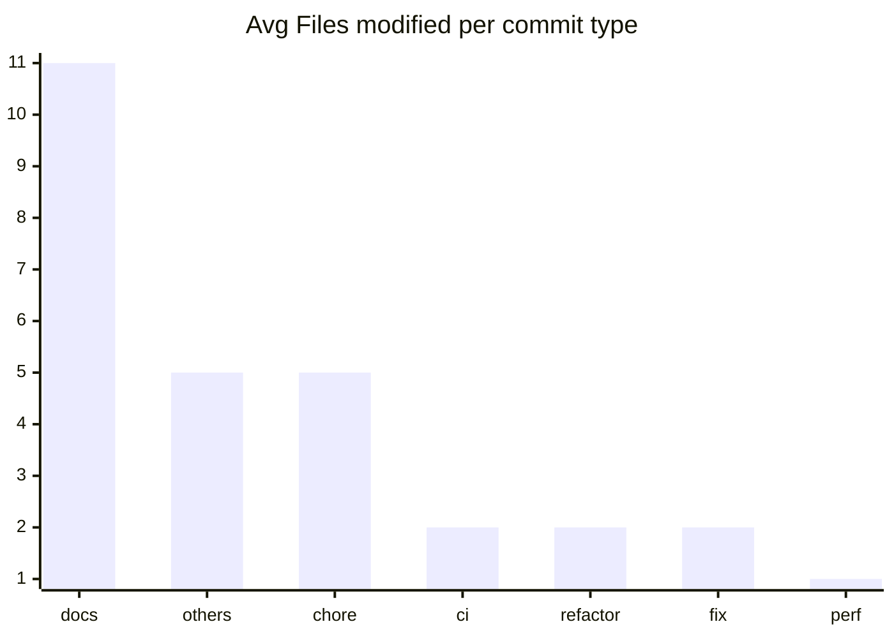

# v3.10.0 ... v3.10.3

``` mermaid
%%{init:{'theme':'base','themeVariables':{'pieTitleTextColor': '#fff','pieLegendTextColor': '#fff',
'pie1':'#ff3100','pie2':'#808b96','pie3':'#2874a6','pie4':'#8e44ad','pie5':'#000000','pie6':'#f9e79f','pie7':'#5dade2'
}}}%%
pie showData title Number of commits: 96
"fix": 33
"chore": 33
"docs": 18
"ci": 7
"others": 3
"perf": 1
"refactor": 1
```
> **WARNING**
> 

3 non conventional commits found:
<ul>
> <li>v3.10.3</li>
> <li>v3.10.2</li>
> <li>v3.10.1</li>
> </ul>

```mermaid
%%{init:{"sankey":{"nodeAlignment":"left"}}}%%
sankey-beta
Gross changes,CI,1239
CI,ci,1095
ci,Net changes,1095
Gross changes,DOCS,1739
DOCS,docs,365
docs,Net changes,365
Gross changes,FIX,377
FIX,fix,187
fix,Net changes,187
Gross changes,CHORE,5761
CHORE,chore,87
chore,Net changes,87
Gross changes,REFACTOR,188
REFACTOR,refactor,76
refactor,Net changes,76
Gross changes,PERF,19
PERF,perf,7
perf,Net changes,7
Gross changes,OTHERS,30
OTHERS,others,0
```

```mermaid
%%{init:{"themeVariables":{"xyChart":{"backgroundColor":"transparent"}}}}%%
xychart-beta
title "Avg Files modified per commit type"
x-axis [docs,others,chore,ci,refactor,fix,perf]
bar [11,5,5,2,2,2,1]
```