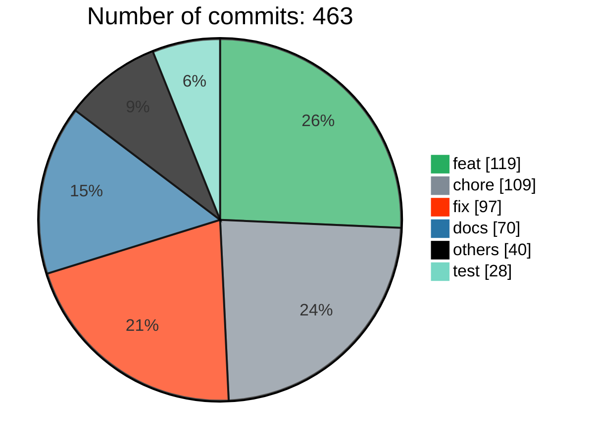
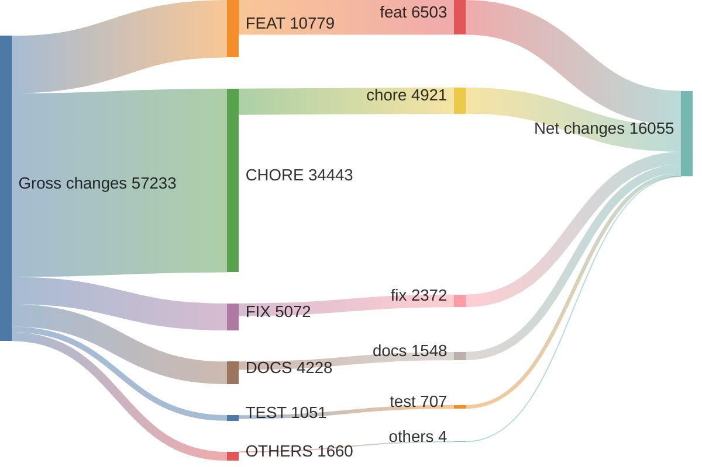
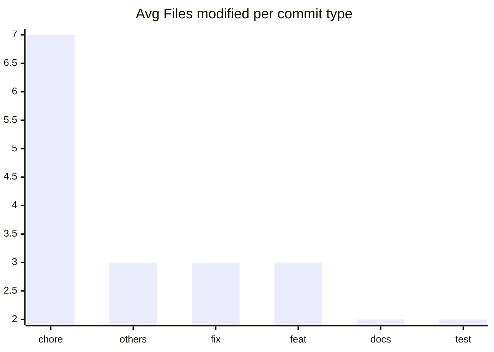

# v1.40.0 ... v1.42.1

> **WARNING**
> 

40 non conventional commits found:
<ul>
> <li>cherry-pick(#29770): docs: improve addLocatorHandler docs</li>
> <li>cherry-pick(#29765): Revert "chore(role): cache element list by role (#29130)"</li>
> <li>cherry-pick(#29766): fix(tsload): fix tsconfig inheritance resolution</li>
> <li>cherry-pick(#29744): fix(ct): stop-gap for shared file import</li>
> <li>cherry-pick(#29754): chore: remove pw- binaries from ct</li>
> <li>cherry-pick(#29748): fix(ct): fix the non-react cli entry points</li>
> <li>cherry-pick(#29738): fix(HEAD): revert GET->HEAD migration, net-effect was negative</li>
> <li>cherry-pick(#29706): fit(ct): remove unused type import (#29709)</li>
> <li>cherry-pick(#29715): fix: point to the right cli program export</li>
> <li>cherry-pick(#29692): docs: better addLocatorHandler example in release notes (#29697)</li>
> <li>cherry-pick(#29687): chore: fix docs roll for functions without args follow-up (#29688)</li>
> <li>cherry-pick(#29669): chore: strengthen linting (#29674)</li>
> <li>devops: add a hint how to create a repro (#29665)</li>
> <li>JUnit codegen (#29424)</li>
> <li>Revert "devops: auto close questions (#29513)"</li>
> <li>devops: auto close questions (#29513)</li>
> <li>Revert "fix(chromium): best effort 304 status on reload (#29373)" (#29481)</li>
> <li>Update test-fixtures-js.md (#29283)</li>
> <li>devops: do not publish sha-X Docker images (#29433)</li>
> <li>devops: fix Android tests (#29335)</li>
> <li>Update feature.yml</li>
> <li>devops: fix roll into PR action (#29318)</li>
> <li>Revert "fix(ct): resolve paths before detecting JS" (#29312)</li>
> <li>devops: custom blob report name for test runner tests (#29280)</li>
> <li>Revert "chore: remove fake `error` from expect calls (#28112)" (#29271)</li>
> <li>devops: run tests on macOS 14 (#29241)</li>
> <li>devops: bump GitHub Actions workflow actions (#29219)</li>
> <li>devops: do not use broken overwrite: true for uploads (#29160)</li>
> <li>devops: switch to ISO date string for Canary versions (#29142)</li>
> <li>devops: make sure uploaded reports always contain directory (#29080)</li>
> <li>Revert "feat(codegen): add range input recording support (#28767)" (#29069)</li>
> <li>Revert "feat(trace): allow Trace Viewer to include credentials when fetching traces cross-origin (#28502)" (#29024)</li>
> <li>devops: merge paginated results when downloading blobs (#29013)</li>
> <li>devops: fix Chromium ToT headed tests (#28892)</li>
> <li>devops: migrate to download/upload-artifact@v4 (#28850)</li>
> <li>devops: fix pr_check_client_side_changes workflow (#28847)</li>
> <li>Revert "fix: respect .only in --list mode" (#28770)</li>
> <li>devops: extend client side changes pattern to include protocol and API changes (#28682)</li>
> <li>Update bug.md</li>
> <li>Revert "chore(test runner): remove fake skipped test results (#27762)" (#28360)</li>
> </ul>

