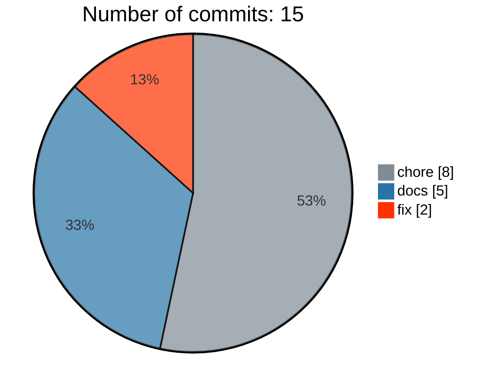
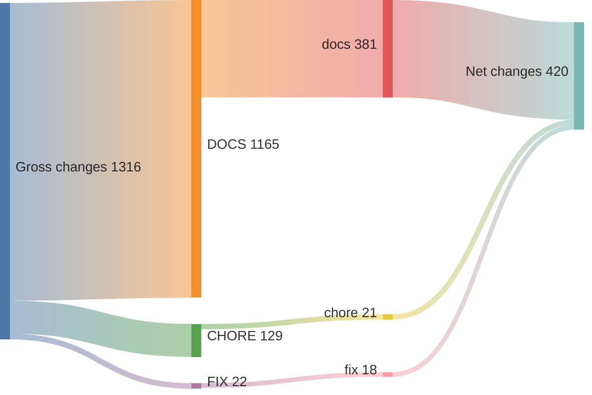
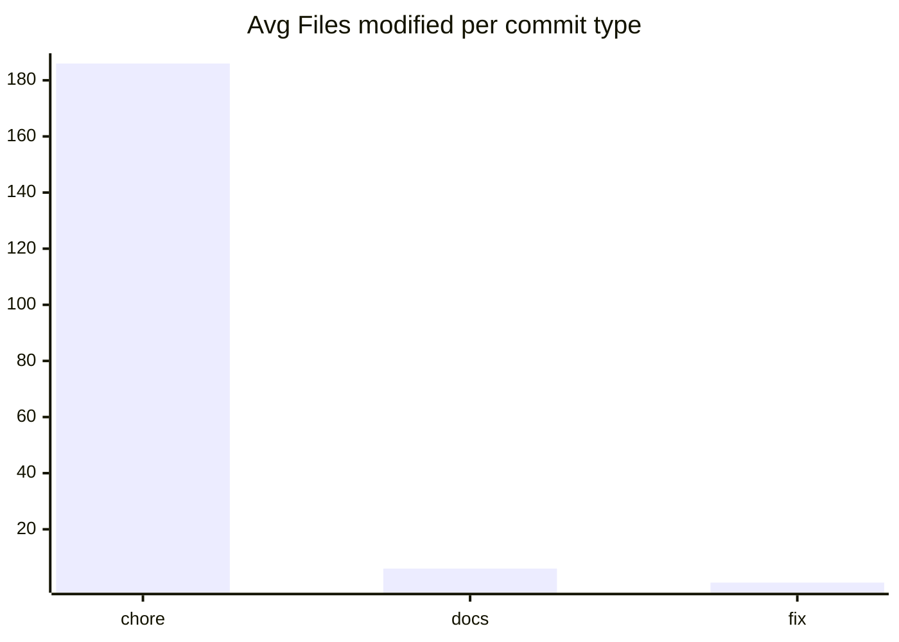

# v19.2.0 ... v19.2.2

``` mermaid
%%{init:{'themeVariables':{
'pie1':'#808b96','pie2':'#2874a6','pie3':'#ff3100'
}}}%%
pie showData title Number of commits: 15
"chore": 8
"docs": 5
"fix": 2
```

```mermaid
%%{init:{"sankey":{"nodeAlignment":"left"}}}%%
sankey-beta
Gross changes,DOCS,1165
DOCS,docs,381
docs,Net changes,381
Gross changes,CHORE,129
CHORE,chore,21
chore,Net changes,21
Gross changes,FIX,22
FIX,fix,18
fix,Net changes,18
```

```mermaid
%%{init:{"themeVariables":{"xyChart":{"backgroundColor":"transparent"}}}}%%
xychart-beta
title "Avg Files modified per commit type"
x-axis [chore,docs,fix]
bar [186,6,1]
```