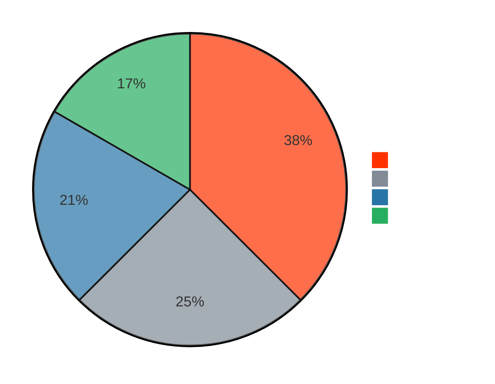
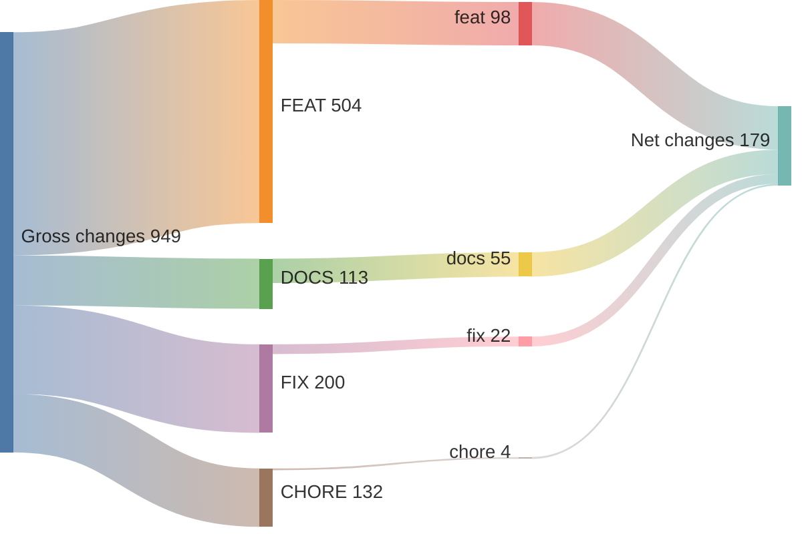
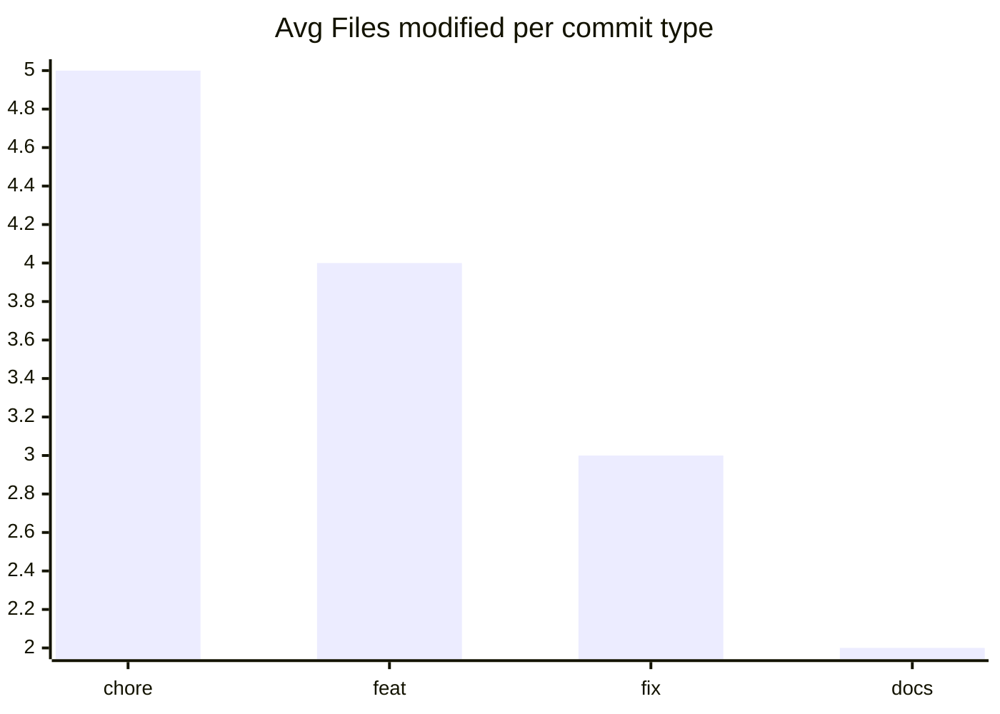

# v0.48.0 ... v0.48.3

``` mermaid
%%{init:{'theme':'base','themeVariables':{'pieTitleTextColor': '#fff','pieLegendTextColor': '#fff',
'pie1':'#ff3100','pie2':'#808b96','pie3':'#2874a6','pie4':'#27ae60'
}}}%%
pie showData title Number of commits: 24
"fix": 9
"chore": 6
"docs": 5
"feat": 4
```

```mermaid
%%{init:{"sankey":{"nodeAlignment":"left"}}}%%
sankey-beta
Gross changes,FEAT,504
FEAT,feat,98
feat,Net changes,98
Gross changes,DOCS,113
DOCS,docs,55
docs,Net changes,55
Gross changes,FIX,200
FIX,fix,22
fix,Net changes,22
Gross changes,CHORE,132
CHORE,chore,4
chore,Net changes,4
```

```mermaid
%%{init:{"themeVariables":{"xyChart":{"backgroundColor":"transparent"}}}}%%
xychart-beta
title "Avg Files modified per commit type"
x-axis [chore,feat,fix,docs]
bar [5,4,3,2]
```