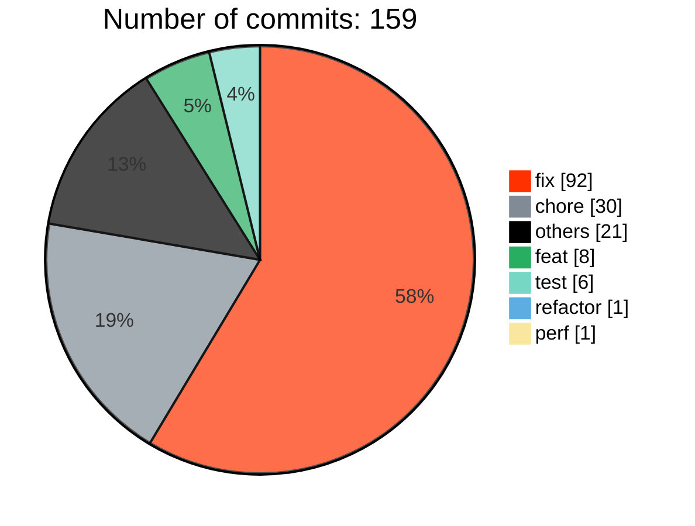
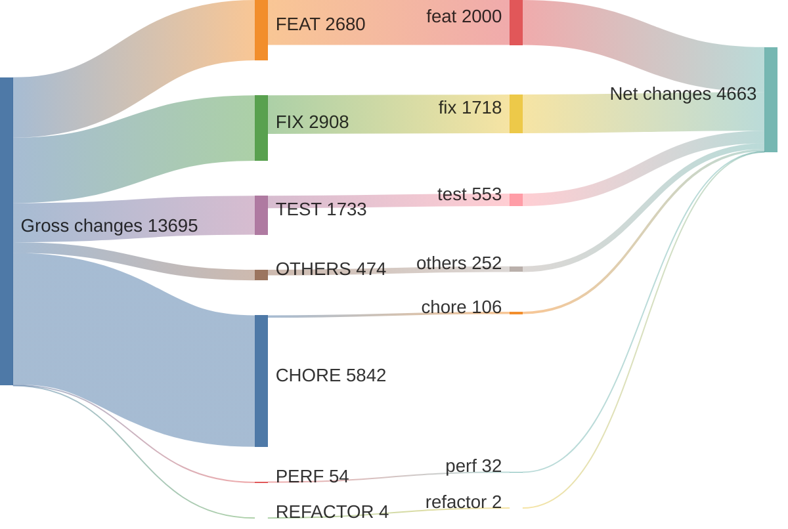
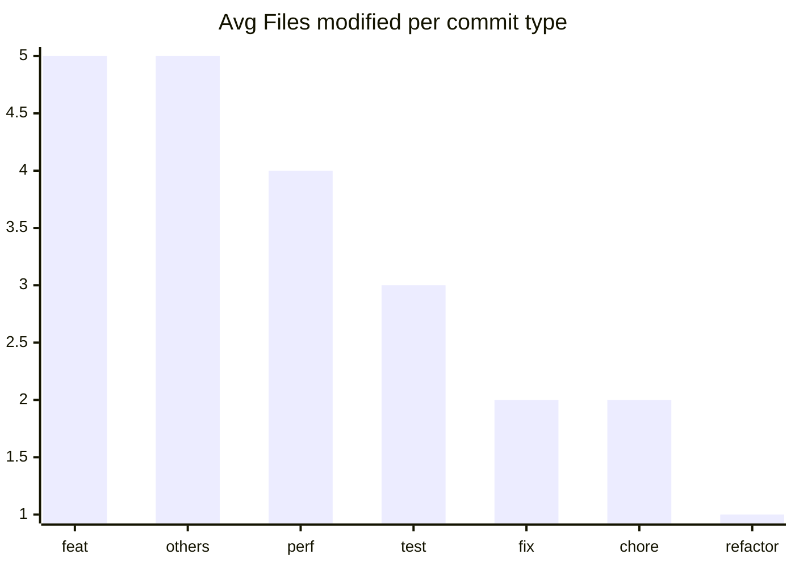

# v2.7.0 ... v2.7.16

> **WARNING**
> 

21 non conventional commits found:
<ul>
> <li>release: v2.7.16</li>
> <li>release: v2.7.16-beta.2</li>
> <li>release: v2.7.16-beta.1</li>
> <li>release: v2.7.15</li>
> <li>release: v2.7.14</li>
> <li>Update the dev to main in the PR template (#12834)</li>
> <li>release: v2.7.13</li>
> <li>release: v2.7.12</li>
> <li>Revert "fix(setup): setup hook should be called before beforeCreate"</li>
> <li>release: v2.7.11</li>
> <li>release: v2.7.10</li>
> <li>release: v2.7.9</li>
> <li>release: v2.7.8</li>
> <li>types: fix manual api types for useAttrs/useListeners</li>
> <li>release: v2.7.7</li>
> <li>release: v2.7.6</li>
> <li>release: v2.7.5</li>
> <li>release: v2.7.4</li>
> <li>release: v2.7.3</li>
> <li>release: v2.7.2</li>
> <li>release: v2.7.1</li>
> </ul>

